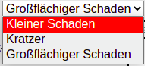

# Flaschenpost-Bulli Fahrzeug-Rückgabe

<b> The Flaschenpost Bully Website / Protocol </b>

This is a website we've been working on for a couple of months now and it is still in development. 
Its only purpose is to make the handing over of vehicles easier. 

So how do I use this website you might ask yourself. 
So lets take a look at the different assets of the website: 

<b>1. Choose your Car </b> 
Normally you would choose between license plates but in this example there are 8 cars to choose from. 

<b>2. Choose your tool</b>  

As you can see, you're able to choose from 3 different tools to edit. 
You can mark little damages, scratches and large scale damages. 
Little damages will be marked with an x, scratches with a line and large scale damages with a circle. 

<b>3. Save</b> 

This website automatically saves your edits. 
Even if you close the browser, wipe your browser cache or delete the coockies. 
If you click on the save button it will download a .save file which you can use  
as a backup or to reupload to another device which can then display all the edits you made. 
Which brings us to the next feature: 

<b>4. Uploading a .save file</b> 

 

As already mentioned in step 3 you can upload .save files to display damages from a second device. 

<b>5. Deleting edits</b>

 

Of course you can delete your edits at any time by just clicking on the red cross of the specific damage you want to remove. 

This website was developed for tablets but can also be used on other devices like smartphones and Laptops.

